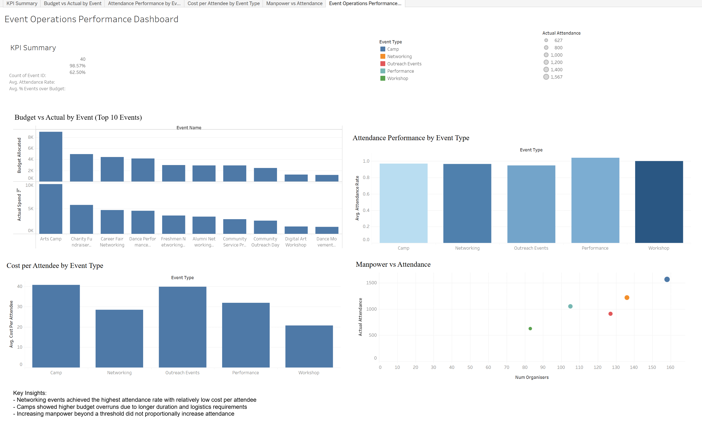

# Event Operations Performance Dashboard

## Overview
This project analyses event operations data to evaluate attendance performance, budget utilisation and manpower efficiency across different event types. The goal is to support data-driven planning and resource allocation decisions.

## Dataset
- 40 simulated events across camps, networking events, workshops, performances and outreach events
- Includes attendance, budget, manpower, venue and feedback metrics

## Tools Used
- Python (pandas, matplotlib)
- SQL (SQLite)
- Tableau

## Analysis Workflow
1. Cleaned and enriched raw event data using Python
2. Created derived metrics such as attendance rate, budget variance and cost per attendee
3. Loaded enriched data into SQLite and performed exploratory SQL analysis
4. Built an interactive Tableau dashboard to visualise key operational metrics

## Key Insights
- Networking events achieved the highest attendance rates with relatively low cost per attendee
- Camps showed higher budget overruns due to longer duration and logistics requirements
- Increasing manpower beyond a threshold did not proportionally increase attendance

## Tableau Dashboard
🔗 [View Dashboard on Tableau Public](https://public.tableau.com/views/EventOperationsPerformanceDashboard/EventOperationsPerformanceDashboard?:language=en-US&publish=yes&:sid=&:redirect=auth&:display_count=n&:origin=viz_share_link)

## Files in This Repository
- `analysis/event_analysis.ipynb`: Data cleaning and analysis in Python
- `sql/analysis_queries.sql`: SQL queries used for exploratory analysis
- `data/`: Raw and enriched datasets

## Notes
This project uses simulated but realistic data based on real-world event operations to demonstrate analytical thinking and technical skills.
